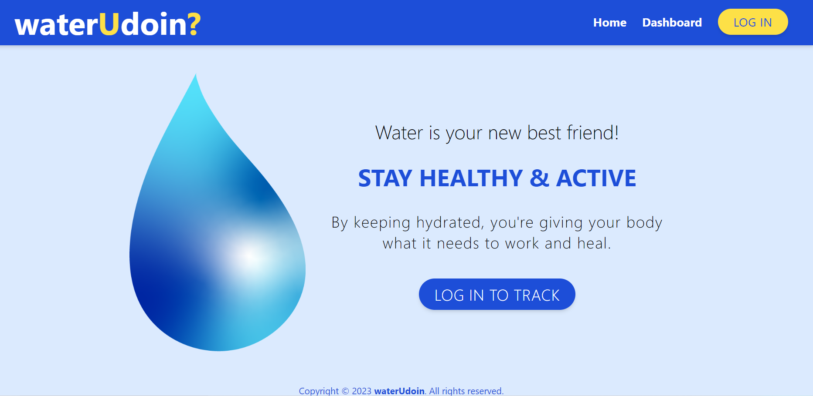
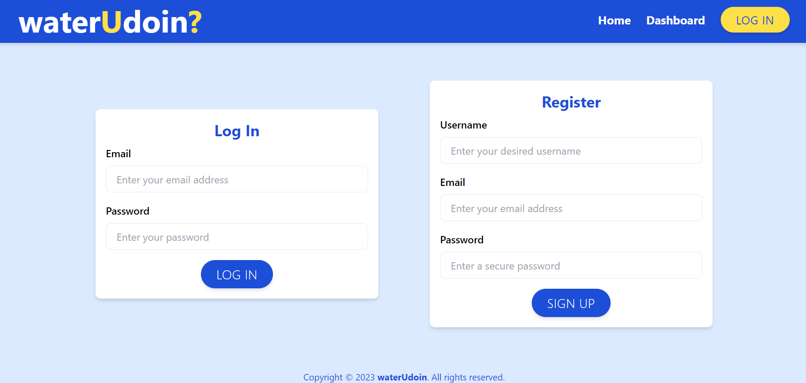
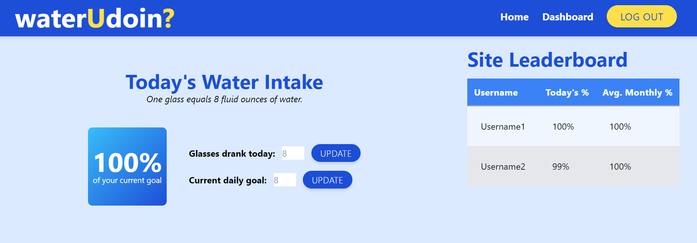
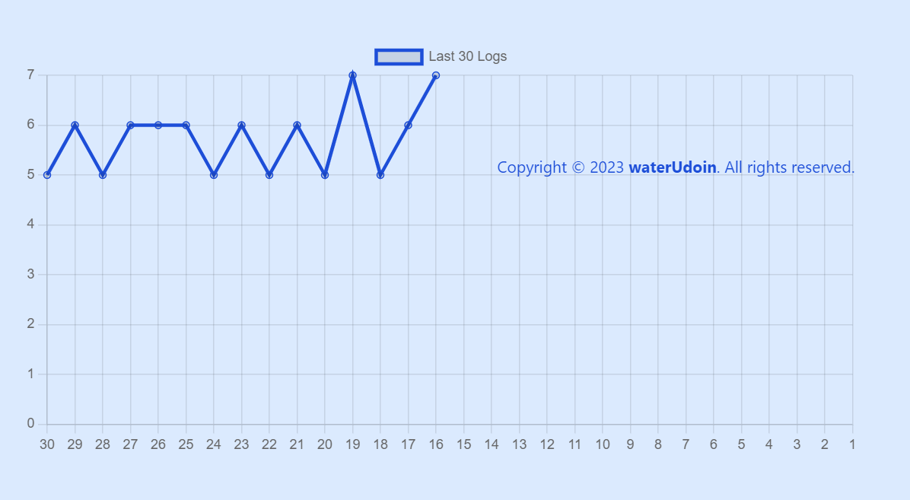

# waterUdoin

waterUdoin is a hydration tracking app that helps motivate you towards your goal by graphing your data and comparing your rank to other users.

## Links for the Project
[github page](https://github.com/CKBoytGT/waterUdoin)

[Heroku]()
## Usage
Sign up for an account, log in and use the "TRACK INTAKE" feature on your dashboard to keep track of your water intake throughout the day. Each symbol represents one 8 fl oz glass of water. The default is five, but you can receive an amount specific to your needs by entering your info under "Update your metrics."

## Screenshots

## Authors
- [Maha Abdelnabi](https://github.com/Maha-Abdelnabi)
- [Christina Boyt](https://github.com/CKBoytGT)
- [Cailen Hamm](https://github.com/cailenh)
- [Graham Knox](https://github.com/Agilitylvl99)
- [Quoc-Tien Ton](https://github.com/TimothyLai1121)
- [Hunter Wilson](https://github.com/HunterWilson1)

## Install
Clone GitHub Repository to local machine & run "npm install" to download all prerequisite packages.